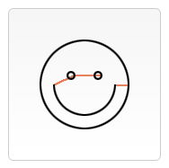
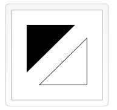

### 如何绘制 矩形、三角形、直线、圆弧和曲线

----

####  栅格
- canvas元素默认被网格所覆盖
- 通常来说网格中的一个单元相当于canvas元素中的一像素
- 可以平移原点到不同的坐标上、旋转网格以及缩放


#### 绘制矩形

- 不同于svg,html中的元素canvas支持一种原生的图形绘制--矩形
- 所有其他的图形的绘制至少需要生成一条路径
- canvas提供了三种方法绘制矩形
  * fillRect(x,y,width,height) 绘制一个填充矩形
  * strokeRect(x,y,width,height) 绘制一个矩形的边框
  * clearRect(x,y,width,height) 清除指定矩形区域，让清除部分完全透明
  * x,y 指定了画布上所绘制的矩形的左上角相对于原点的坐标
  * width,height 设置了矩形的尺寸
  
#### 矩形例子

````js
function draw() {
  var canvas=document.getElementById("canvas");
  if(canvas.getContext){
      var ctx=canvas.getContext("2d");
      ctx.fillRect(30,30,40,50); //绘制一个坐标x30、y30、width40、height50，默认填充黑的矩形
      ctx.clearRect(31,31,40,50); //清除指定矩形区域，让清除部分完全透明
      ctx.strokeRect(50,50,30,30);//绘制一个矩形边框
  }
}

````


#### 绘制路径

- 图形的基本是路劲。路径是通过不同颜色和宽度的线段相连形成的不同形状的点的集合
- 一个路径，甚至一个子路径，都是闭合的。
- 步骤：
   * 首先，你需要创建路径的起始点
   * 然后你使用画图命令去画出路径
   * 之后把路径封闭
   * 一旦路径生成，就能通过描边或者填充路径区域来渲染图形
   
- API 
   * beginPath() 新建一条路径，生成之后，图形绘制命令被指向路径上生成的路径
   * closePath() 闭合路径之后图形绘制命令又重新指向上线文中。
   * stroke() 通过线条来绘制图形轮廓。
   * fil() 通过填充路径的内容区域生成实心的图形
   
- 生成路径的第一步叫做beginPath()。
  * 本质上，路径是又子路径构成，这些路径都是在一个列表中
  * 所有的子路径（线、弧形、等等）构成图形。
  * 而每次这个方法调用之后，列表清空重置，然后我们就可以重新绘制行的图形
  
- 第二步就是调用函数指定绘制路径，本文稍后我们就能看到
- 第三步就是闭合路径closePath(),不是必须的，这个方法会通过绘制一条从当前点到开始点的直线来闭合。如果已经闭合则什么都不做。

- 绘制三角形
````html
<canvas id="canvas" width="200" height="200">
您的浏览器不支持canvas标签
</canvas>

<script  type="text/javascript">
var can=document.getElementById("canvas");
     if(can.getContext){
         var ctx=can.getContext("2d");
         ctx.beginPath();
         ctx.moveTo(60,60);
         ctx.lineTo(80,40);
         ctx.lineTo(80,80);
         ctx.fill();
     }

</script>

````

#### 移动笔触

- 一个非常有用的函数，而这个函数实际上不能画出任何东西，
- 是路劲列表的一部分，这个函数就是moveTo() 
- 或者你可以想象一下在纸上作业，一只钢笔或者铅笔的笔尖从一个点到另一点的移动过程
  * moveTo(x,y) 将笔触移动到指定的坐标x以及y上
  * 调用beginPath后，通常会使用moveTo()函数上设置起点。
  * 我们也能够使用moveTo()绘制一些不连续的路径
  
 **示例：**
 
````html

<canvas id="can" width="300" height="300">
 您的浏览器不支持canvas
</canvas>
<script type="text/javascript">
 var canvas=document.getElementById("can");
   if(canvas.getContext){
       var ctx=canvas.getContext("2d");
    ctx.beginPath();
    ctx.arc(150,150,70,0,Math.PI*2,true);
    ctx.moveTo(200,160);
    ctx.arc(150,160,50,0,Math.PI,false);
    ctx.moveTo(190,130);
    ctx.arc(180,130,10,0,Math.PI*2,true);
    ctx.stroke();
         }

</script>

````

  


#### 线

> 绘制直线需要使用的方法是lineTo()

- api  **lineTo(x,y)**

> 改方法有两个参数：x以及y,代表坐标中直线结束的点， 开始点和之前绘制路径有关
，之前绘制的结束点就是接下来的开始点，开始点也可以通过moveTo函数来该变


> 案例

```html
<canvas id="can" width="300px" height="300px">
您的浏览器不支持canvas标签
</canvas>
<script type="text/javascript">
  var box=document.getElementById("can");
  if(can.getContext){
      var c=can.getContext("2d");
      //填充三角形
      c.beginPath();
      c.moveTo(25,25);
      c.lineTo(105,25);
      c.lineTo(25,105);
      c.fill();
      //边框三角形
      c.beginPath();
      c.moveTo(125,125);
      c.lineTo(125,45);
      c.lineTo(45,125);
      c.closePath();
      c.stroke();
  }

</script>

```

> 从调用beginPath()函数准备绘制一个新的路径开始。然后使用moveTo()函数移动到目标位置。




> 描边strock是不会自动闭合路径的，如果不适用closePath(),则只会绘制两条线段
> 填充fill() 是会自动闭合三角形的